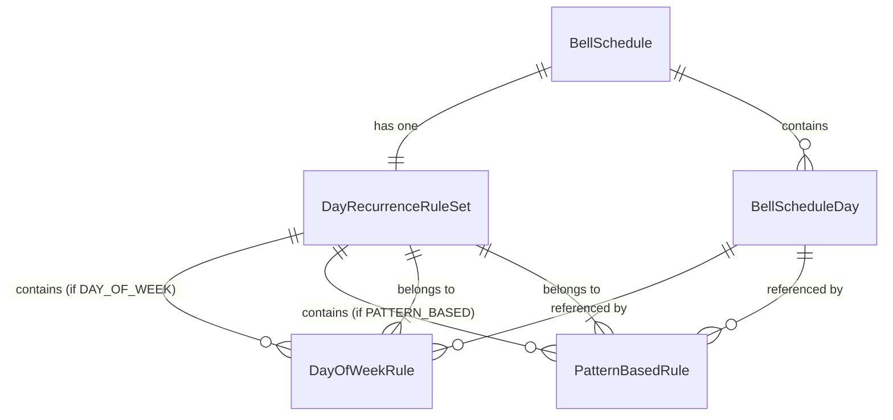

# Bell Schedule Day-Based Recurrence Rules Design

## Overview

The bell schedule system supports two types of day-based recurrence rules that determine which `BellScheduleDay` should be used on any given date. **Each `BellSchedule` has exactly one recurrence rule type** - either day-of-week OR pattern-based, never both.

1. **Day-of-Week Rules**: Simple weekly patterns where specific days of the week use specific schedule days
2. **Pattern-Based Rules**: Repeating patterns that cycle through schedule days based on a seed date

## Data Model Architecture

### Core Models

#### `DayRecurrenceRuleSet`
- **One-to-one relationship** with `BellSchedule` - each schedule has exactly one rule set
- Type field determines whether it contains day-of-week or pattern-based rules
- For pattern-based rules, stores the `seedDate` at the rule set level
- Includes metadata like name, description, and timestamps

#### `DayOfWeekRule`
- Maps specific days of the week (0=Sunday, 6=Saturday) to `BellScheduleDay` instances
- Supports a default day that applies when no specific rule exists
- Unique constraint ensures one rule per day of week per rule set
- **Only used when rule set type is `DAY_OF_WEEK`**

#### `PatternBasedRule`
- Each rule represents one position in a cyclical pattern
- Pattern is constructed by ordering rules by `patternPosition` (0-based index)
- No redundant pattern string storage - pattern emerges from the sequence of schedule days
- **Only used when rule set type is `PATTERN_BASED`**

## Usage Examples

### Day-of-Week System

```typescript
// Example: "Regular Day" is default, "Odd Day" on Wednesday, "Even Day" on Thursday
const ruleSet = {
  name: "Weekly Schedule",
  type: "DAY_OF_WEEK",
  seedDate: null, // Not used for day-of-week rules
  dayOfWeekRules: [
    { dayOfWeek: 0, scheduleDayId: "regular-day-id", isDefault: true },  // Sunday (default)
    { dayOfWeek: 1, scheduleDayId: "regular-day-id", isDefault: false }, // Monday
    { dayOfWeek: 2, scheduleDayId: "regular-day-id", isDefault: false }, // Tuesday
    { dayOfWeek: 3, scheduleDayId: "odd-day-id", isDefault: false },     // Wednesday
    { dayOfWeek: 4, scheduleDayId: "even-day-id", isDefault: false },    // Thursday
    { dayOfWeek: 5, scheduleDayId: "regular-day-id", isDefault: false }, // Friday
    { dayOfWeek: 6, scheduleDayId: "regular-day-id", isDefault: false }  // Saturday
  ]
}
```

### Pattern-Based System

```typescript
// Example: ABBA pattern starting from September 1, 2025
// Pattern emerges from the sequence: A-B-B-A (positions 0,1,2,3)
const ruleSet = {
  name: "ABBA Rotation",
  type: "PATTERN_BASED",
  seedDate: "2025-09-01T00:00:00Z", // Stored at rule set level
  patternBasedRules: [
    { patternPosition: 0, scheduleDayId: "schedule-a-id" }, // A
    { patternPosition: 1, scheduleDayId: "schedule-b-id" }, // B
    { patternPosition: 2, scheduleDayId: "schedule-b-id" }, // B
    { patternPosition: 3, scheduleDayId: "schedule-a-id" }  // A
  ]
}
// This creates the pattern: A-B-B-A repeating every 4 days from the seed date
```

## Design Decisions

### 1. **Single Rule Type Per Schedule**
- Each `BellSchedule` has exactly one `DayRecurrenceRuleSet` (one-to-one relationship)
- Rule set type determines which child rules are valid
- Prevents conflicting rule types and simplifies business logic
- Clear ownership model with cascade deletion

### 2. **Position-Based Pattern Storage**
- No redundant pattern string storage across multiple rules
- Pattern emerges naturally from ordering rules by `patternPosition`
- More efficient storage and eliminates data consistency issues
- Pattern length is determined by the count of pattern-based rules

### 3. **Centralized Seed Date**
- `seedDate` stored once at the `DayRecurrenceRuleSet` level for pattern-based rules
- All pattern positions share the same seed date automatically
- Reduces redundancy and ensures consistency

### 4. **Rule Set Level Metadata**
- `name` and `description` help identify and manage rule sets
- `type` enum clearly distinguishes behavior
- Timestamps track creation and modification

### 5. **Maintained Constraints**
- `DayOfWeekRule`: Unique on `[ruleSetId, dayOfWeek]` - one rule per day per set
- `PatternBasedRule`: Unique on `[ruleSetId, patternPosition]` - unique positions in pattern
- `DayRecurrenceRuleSet`: Unique `scheduleId` ensures one rule set per schedule

## Implementation Considerations

### Date Resolution Algorithm

#### Day-of-Week Rules
1. Get day of week for target date (0-6)
2. Find rule matching the day of week in the rule set
3. If no rule found, use the rule marked as `isDefault: true`
4. Return the associated `BellScheduleDay`

#### Pattern-Based Rules
1. Calculate days since seed date from the rule set
2. Get all pattern rules ordered by `patternPosition`
3. Use modulo operation: `daysSinceSeed % patternLength`
4. Return the `BellScheduleDay` from the rule at that position

### Pattern Construction Example
```typescript
// Given these rules:
// Position 0 -> Schedule Day A
// Position 1 -> Schedule Day B  
// Position 2 -> Schedule Day B
// Position 3 -> Schedule Day A

// The effective pattern is: A-B-B-A
// Day 0 (seed): A, Day 1: B, Day 2: B, Day 3: A, Day 4: A (repeats), etc.
```

### Validation Rules
- Each rule set must have exactly one default day (for day-of-week type)
- Pattern-based rule sets must have contiguous positions starting from 0
- Rule set type must match the type of child rules present
- Pattern-based rule sets must have a valid `seedDate`

### Future Extensibility
- New recurrence rule types can be added by:
  1. Adding new enum values to `RecurrenceRuleType`
  2. Creating new rule models with relation to `DayRecurrenceRuleSet`
  3. Adding type-specific fields to `DayRecurrenceRuleSet` if needed
- The one-to-one relationship maintains simplicity while allowing evolution

## Database Relationships



## Key Improvements

1. **Simplified Architecture**: One rule type per schedule eliminates complexity
2. **Efficient Storage**: Pattern emerges from positions, no string duplication
3. **Data Integrity**: One-to-one relationship prevents orphaned rule sets
4. **Cleaner Logic**: Type-specific behavior is clearly separated
5. **Consistent Patterns**: Seed date centralized at rule set level

This design provides a clean, efficient foundation for both simple weekly schedules and complex rotating patterns while maintaining strict data integrity and clear business rules. 